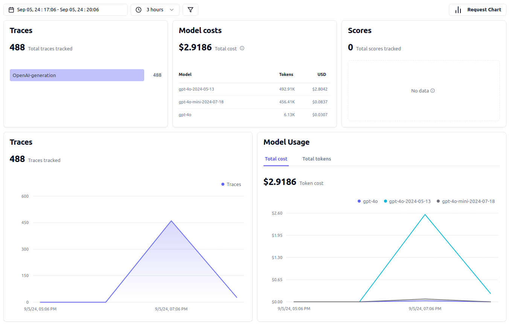
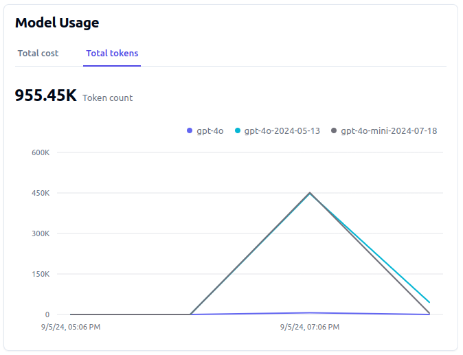
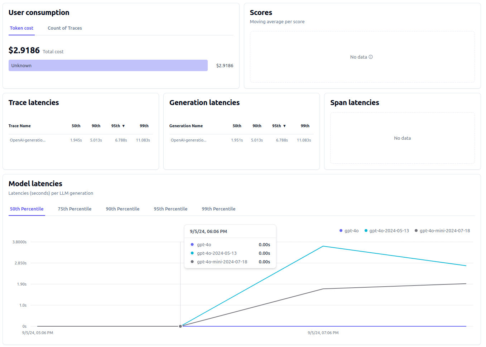
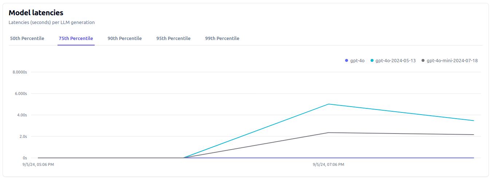
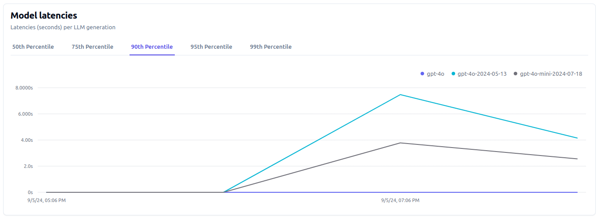
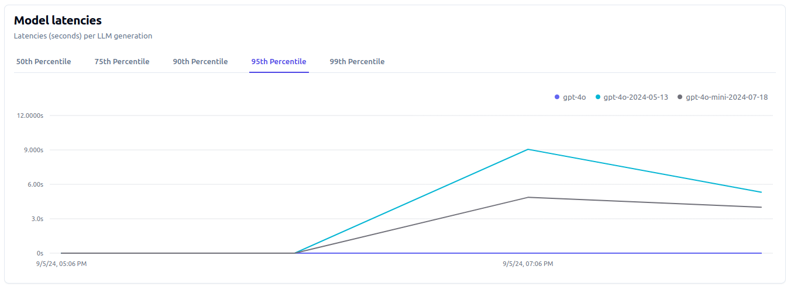
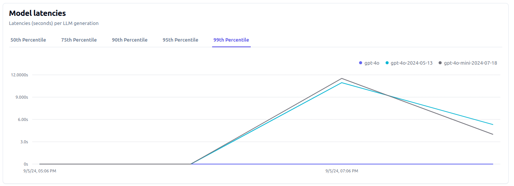

# Mental Health Assistant


The primary problem addressed by this project is the lack of easily accessible and reliable mental health information. Many people struggle to find accurate answers to their mental health questions, leading to confusion, misinformation, and delayed seeking of professional help. Current mental health resources often rely on human experts, resulting in long wait times and inconsistent responses.

## Project Overview

This project aims to create a friendly mental health assistant using a Retrieval-Augmented Generation (RAG) approach. The assistant will be trained on the provided dataset to provide accurate and helpful responses to mental health-related questions.

Key features of the solution include:

- Accessible mental health information: Users can quickly receive answers to their mental health questions anytime and anywhere.
- Consistent responses: The AI assistant ensures consistent information across all interactions.
- Wide-ranging coverage: The system addresses a broad spectrum of mental health topics.
- User-friendly interface: The assistant is designed to be approachable and supportive.

## Data Description

This project utilizes a dataset containing mental health-related questions and answers. The dataset consists of:

- Question_ID: Unique identifier for each question
- Questions: The actual mental health-related queries
- Answers: Comprehensive explanations and information addressing the questions

You can find the data in [`data/Mental_Health_FAQ.csv`](data/Mental_Health_FAQ.csv).

## Technologies

* Python 3.12
* Docker and Docker Compose for containerization
* Minsearch for full-text search
* OpenAI as an LLM
* Streamlit as an web interface. In this project, Streamlit is used to build a chatbot application that: 

    - Allows Users to Ask Questions: Enter questions and receive answers from a mental health knowledge base.
    - Displays Answers: Shows responses generated by the chatbot.
    - Collects Feedback: Lets users provide feedback on the answers.


## Running the application

To run the mental health assistant in Jupyter Notebooks, follow these steps:

1. Make sure you have Python 3.12 installed on your system.

2. Copy `.env_template` file into `.env` file and insert your OpenAI API key there. 

3. Install the required dependencies by running the following command in a code cell:
    ```python
    !pip install -r requirements.txt
    ```

3. Run the Jupyter Notebook for experiments.

### Database configuration
Before the application starts for the first time, the database needs to be initialized.

First, run postgres:
```bash
docker-compose up postgres
```

Then run the [`db_prep.py`](mental_health_assistant/db_prep.py) script:
```bash
cd mental_health_assistant

export POSTGRES_HOST=localhost
python db_prep.py
```

### Running with Docker-Compose

The easiest way to run the application is with docker-compose:
```bash
docker-compose up
```
### Running with Docker (without compose)

Sometimes you might want to run the application in Docker without Docker Compose, e.g., for debugging purposes.

First, prepare the environment by running Docker Compose as in the previous section.

Next, build the image:
```bash
docker build -t mental-health-chatbot .
```

And run it:
```bash
docker run -it --rm \
  -e OPENAI_API_KEY="${OPENAI_API_KEY}" \
  -e DATA_PATH="data/Mental_Health_FAQ.csv" \
  -p 5000:5000 \
  mental-health-chatbot
```

### Running the Streamlit app

Start the Streamlit interface by running the [`app.py`](mental_health_assistant/app.py) script. Open your terminal, navigate to the `mental_health_assistant` directory, and execute:

```bash
streamlit run app.py
```

Streamlit will provide a URL in the terminal. Open this URL in your web browser to access the chat interface. You can now enter your questions into the text box, submit them, view the answers from the LLM, and provide feedback.

## Code

The code for the application is in the 
[`mental_health_assistant`](mental_health_assistant/) folder:

- [`app.py`](mental_health_assistant/app.py) - the Streamlit application
- [`ingest.py`](mental_health_assistant/ingest.py) - loading the data into the knowledge base
- [`minsearch.py`](mental_health_assistant/minsearch.py) - an in-memory search engine
- [`rag.py`](mental_health_assistant/rag.py) - the main RAG logic for building the retrieving the data and building the prompt 
- [`db.py`](mental_health_assistant/db.py) - the logic for logging the requests and responses to postgres
- [`db_prep.py`](mental_health_assistant/db_prep.py) - the script for initializing the database
 

## Interface
I use Streamlit for serving the application.

Refer to [`"Running the Streamlit app" section`](#running-the-streamlit-app) for more detail.


## Ingestion
The ingestion script is in [`ingest.py`](mental_health_assistant/ingest.py).

Since I use an in-memory database, `minsearch`, as our knowledge base, I run the ingestion script at the startup of the application.

It's executed inside [`rag.py`](mental_health_assistant/rag.py) when I import it.

## Experiments

For experiments, we use Jupyter notebooks. They are in the [`notebooks`](notebooks/) folder.

For the code for evaluating the system, you can check the [`notebooks/rag-test.ipynb`](notebooks/rag-test.ipynb) noteboook.


Notebooks:

* [`rag-test.ipynb`](notebooks/rag-test.ipynb): the RAG flow and evaluating
* [`evaluation-data-generation.ipynb`](notebooks/evaluation-data-generation.ipynb): generating the ground truth dataset for retrieval evaluation

### Retrieval evaluation

The basic approach - using `minsearch` without any boosting - gave the following metrics:

* hit_rate: 90%
* MRR: 66% 

The improved version (with better boosting):

* hit_rate: 93%
* MRR: 75%

The best boosting parameters:

```python
boost = {
    'Question_ID': 1.95,
    'Questions': 0.46,
    'Answers': 2.85
}
```

### RAG flow evaluation

I used the LLM as a Judge metric to evaluate the quality of the RAG flow.

For gpt-4o-mini, among 100 sample records, I had:

* 96 (96%) RELEVANT
* 4 (4%) PARTLY_RELEVANT
* 0 (0%) IRRELEVANT

I also tested qpt-4o:

* 94 (94%) RELEVANT
* 6 (6%) PARTLY_RELEVANT
* 0 (0%) IRRELEVANT


## Monitoring
[LangFuse](https://cloud.langfuse.com) is a callback handler for logging and monitoring performance. It helps us to visualize and analyze our application's traces effectively. 

So, to have access to LangFuse traces, create an account [here](https://cloud.langfuse.com/auth/sign-up). Then create a new project and then create new API credentials in the project settings. Add the secret key, the public key, and langfuse host to your environment variables as LANGFUSE_SECRET_KEY; LANGFUSE_PUBLIC_KEY; and LANGFUSE_HOST respectively.

You can access the LangFuse dashboard by logging into your account at [LangFuse](https://cloud.langfuse.com/auth/sign-up).

At the Langfuse dashboard we can see the `traces` that record every interaction with the model and `model costs` which refer to the costs required to operate and maintain the model. We can also see:
- `Trace Latencies`: This is the time taken to process and respond to individual requests. It helps us gauge the responsiveness of the model.
- `Generation Latencies`: This metric tracks the total time taken by the model to generate a response after receiving a request. It’s crucial for assessing how quickly the model delivers results.
- `Model Latencies`: This represents the overall time for the model to process a request and produce a response. It’s an important indicator of the model’s overall efficiency.

### Dashboards






